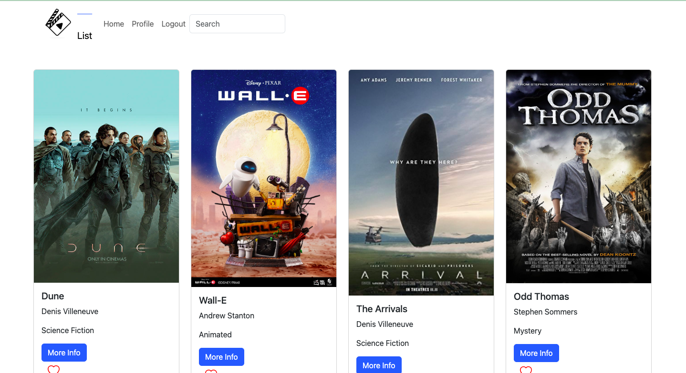

# MyFlix

## Project Description

MyFlix is a movie website that showcases my personal top 10 movies. Users can signup and discover more details about my favorite movies!

## Tech Stack

Mern (MongoDB, Express, React, and Node.js)

## Features

- Search bar to filter through movies
- Ability to view more details about a movie
- Add/Remove movies from their list of favorites
- Update their user information

## Project Link

Link to App's Respository:
https://github.com/HadRad500/MyFlix-Client.git

Link to Live App:
https://myflix-hadrad-500.netlify.app/
